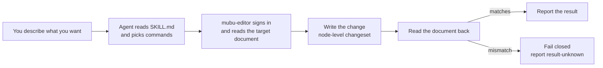

# mubu-editor

> Give your AI agent hands inside Mubu — read, write and edit the documents in your account.

[](https://www.python.org/)
[](https://github.com/Rainier-Z/mubu-editor/actions/workflows/test.yml)
[](LICENSE)


## Overview

**mubu-editor** is an **integration layer that gives an AI agent access to Mubu (幕布)**.

It lets your agent read, write and edit the documents in your account: node text, heading levels, native styles (mask / highlight / formula), internal document links and node references, summaries, todos, emoji, native tables, images and connector lines.

It is built for people who **already run an AI agent over their knowledge base**, and solves one specific problem: **Mubu has no open platform**, so an agent cannot reach it — which keeps your outlines out of your agent's workflow.

## What it looks like

Once it is wired up, you just talk:

```text
You   > In my Mubu doc "Reading notes", make every heading in chapter 3
        level 2, add a summary over that chapter, and create a share link.

Agent > Done. 3 headings set to level 2, the summary now covers all 7 nodes
        in chapter 3, and the share link is https://share.mubu.com/doc/xxxxxxxx
        (every write was read back and verified)
```

The agent picks the commands, runs them, and **reads the document back to verify** — you never type a parameter.

## Highlights and features

### Highlights

| Highlight | Description |
| --- | --- |
| **Edits at node level, not just whole documents** | Changes what is *inside* a document: text, heading levels, styles, structure, images, tables and links |
| **Onboards as an Agent Skill** | The repo ships its skill definition (`SKILL.md`); wire it up once and the agent knows when to reach for it |
| **Complete capability set** | 42 commands covering account, document management, node editing, styles, structured elements, collaboration and export |

### Core features

| Feature | Description |
| --- | --- |
| **Account & session** | Phone + password login; the token is refreshed automatically as it nears expiry |
| **Documents & folders** | List / create / read / save / rename / move / soft-delete, with a local trash you can restore from |
| **Node-level editing** | Append nodes, insert children, reorder, delete a subtree, collapse, todo state, emoji, connector lines |
| **Text & styling** | Set heading levels, mask text, highlight, native Mubu formulas, bold and colour |
| **Structured elements** | Native tables (create / export), local image upload, multi-node summaries, internal links, node references, native hyperlinks |
| **Collaboration & assets** | Backlinks ("who links to me"), the official import channel, view switching |
| **Export** | OPML / FreeMind, whole-tree export, table export to Markdown / CSV |

## Workflow



## Getting started

### Prerequisites

Before using this project you need:

- OS: Windows / Linux / macOS
- Runtime: **Python 3.10+**
- Network access to `https://api2.mubu.com`
- Credentials: your **own Mubu account** (phone + password)
- An agent that supports Skills, or can read files from a repo (e.g. Codex / Claude Code)

### Installation

1. Configure your Mubu credentials

   Credentials are **never** passed as CLI arguments. Use environment variables:

   ```bash
   export MUBU_PHONE="your-phone"
   export MUBU_PASSWORD="your-password"
   ```

   …or write them to `config/.env.mubu` (env vars take precedence; the file is auto-chmod `0o600`):

   ```ini
   MUBU_PHONE=your-phone
   MUBU_PASSWORD=your-password
   ```

2. Clone and install dependencies

   ```bash
   git clone https://github.com/Rainier-Z/mubu-editor.git
   cd mubu-editor

   # Linux / macOS
   pip install -r requirements.txt -r requirements-dev.txt
   # Windows (the dev lock file adds colorama)
   pip install -r requirements.txt -r requirements-dev-windows.txt
   ```

3. Install the Skill for your agent

   The repo ships an installer. It uses **link** mode by default (edits to the repo take effect immediately); `-Copy` writes a self-contained copy instead.

   ```bash
   # Windows
   ./install-skill.ps1                    # link into codex
   ./install-skill.ps1 -Agents codex,claude    # several agents at once
   ./install-skill.ps1 -Copy              # copy install

   # Linux / macOS
   ./install-skill.sh
   AGENTS=codex,claude ./install-skill.sh
   MODE=copy ./install-skill.sh
   ```

   The script places this repo at `~/.<agent>/skills/mubu-editor`, where the agent finds `SKILL.md`.
4. Start talking

   Then ask for what you want in plain language, e.g. "list the documents in my Mubu root folder".

## Minimal verification

To check the toolchain is wired up, run a login by hand:

```bash
python3 scripts/mubu_api.py login
```

Expected output:

```text
Login successful
```

## Disclaimer

- This is an **unofficial** integration: not affiliated with, endorsed by, or connected to Mubu.
- It operates only on **your own account**, using credentials you supply and store locally.
- Review Mubu's Terms of Service and your local laws before use. **Account and data risk is your own.**
- It does **not** provide — and must not be used for — bypassing payments, bulk scraping, multi-account rotation, or unauthorized access.

## Contributing

Issues, suggestions and pull requests are welcome.

1. Fork the project
2. Create a feature branch

   ```bash
   git checkout -b feature/AmazingFeature
   ```

3. Commit your changes

   ```bash
   git commit -m "Add AmazingFeature"
   ```

4. Push the branch

   ```bash
   git push origin feature/AmazingFeature
   ```

5. Open a pull request

## License

[MIT](LICENSE)
