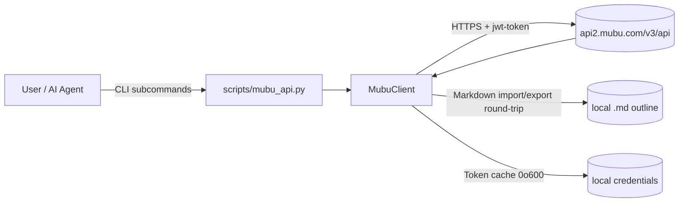
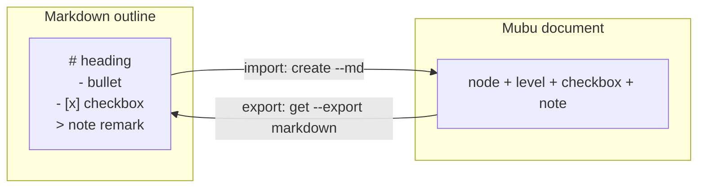

[English](README.md) | [中文](README.zh-CN.md)

<p align="center">
  
</p>

# mubu-editor

> Turn Mubu (幕布) into a Markdown-native, AI-agent-controllable outliner.

[](https://opensource.org/licenses/MIT)

Manage your Mubu (幕布) outlines from the command line — **and as an AI Agent Skill** — with semantic Markdown import/export for supported outline structures.

---

## ✨ Try it in 3 commands (magic moment)

```bash
python3 scripts/mubu_api.py create "周会" --md examples/weekly.md    # Markdown outline → Mubu
python3 scripts/mubu_api.py get <doc-id> --export markdown > out.md  # Mubu → Markdown
diff -u examples/weekly.md out.md                                  # compare supported outline semantics
```

---

## 🆚 Why mubu-editor?

| Capability | Manual copy | Existing export-plugin scripts | **mubu-editor** |
| :--- | :---: | :---: | :---: |
| Mubu → Markdown | ✅ | ⚠️ partial | ✅ |
| Markdown → Mubu | ❌ | ❌ | ✅ **(only)** |
| Supported outline semantics round-trip | ❌ | ❌ | ✅ **(only)** |
| Whole-tree batch / OPML / FreeMind | ❌ | ⚠️ some | ✅ |
| Callable by an AI Agent | ❌ | ❌ | ✅ **(only)** |
| Scriptable from the command line | ❌ | ⚠️ | ✅ |

---

## 💡 Use cases

**① Let your AI Agent read & write Mubu directly** — turn Mubu into your Agent's long-term, structured memory.

```bash
python3 scripts/mubu_api.py get <doc-id> --export markdown > memory.md   # Agent pulls the latest outline
# ... Agent edits memory.md ...
python3 scripts/mubu_api.py save <doc-id> --md memory.md                 # writes the updated outline back to Mubu
```

**② Obsidian ↔ Mubu, two-way outlines** — keep your knowledge base and your outliner in sync as plain Markdown.

```bash
python3 scripts/mubu_api.py get <doc-id> --export markdown > vault/notes/mubu.md   # Mubu → Obsidian
python3 scripts/mubu_api.py create --md vault/notes/mubu.md --folder <folder-id>   # Obsidian → Mubu
```

**③ Auto-archive weekly meeting notes** — push `examples/weekly.md` into Mubu in one step.

```bash
python3 scripts/mubu_api.py create "周会" --folder <folder-id> --md examples/weekly.md
```

---

## 🚀 30-second quick start

1. Set your Mubu credentials (phone + password). They are never passed as CLI arguments — use env vars or a local file:

   ```bash
   export MUBU_PHONE="your-phone"
   export MUBU_PASSWORD="your-password"
   ```

   …or write them to `config/.env.mubu` (env vars take precedence; the file is auto-chmod `0o600`):

   ```ini
   MUBU_PHONE=your-phone
   MUBU_PASSWORD=your-password
   ```

2. Grab the bundled sample outline (`examples/weekly.md`):

   ```markdown
   # 产品周会
   - 上周进展
     - [x] 上线新版本
     - [ ] 修复登录 bug
   - 本周计划
     - 性能优化
   > 备注：记得同步给设计团队
   ```

3. Import it, then export it back — headings, `[x]` checkboxes and `> note` remarks all survive intact:

   ```bash
   python3 scripts/mubu_api.py create "产品周会" --folder <folder_id> --md examples/weekly.md
   python3 scripts/mubu_api.py get <doc_id> --export markdown
   ```

---

## 📦 Install

This project is used from its local checkout. Install the runtime and development dependencies, then invoke the bundled entry point:

```bash
python -m pip install -r requirements.txt
```

This installs the Skill for your agent. It is a Python package — you also need **Python 3.10+** and the runtime dependency:

```bash
pip install -r requirements.txt
```

Dev/test dependencies use `requirements-dev.txt` on Linux and macOS, and
`requirements-dev-windows.txt` on Windows.

---

## 🛡️ Reliability

mubu-editor talks to the **same HTTPS endpoints the Mubu web app uses** — no scraping, no browser automation.

- ⚠️ **Live-service verification is separate** — run the project validation script only when account authentication is available; local tests do not prove real-service behavior.
- ✅ **Automated tests** — run the test suite locally or through the configured CI workflow; the current count is intentionally not fixed in this document.
- ✅ **Auto-refresh auth** — expired tokens re-login automatically using your cached credentials (env vars / `config/.env.mubu`); no manual re-entry needed after initial setup.
- ✅ **Pinned supply chain** — `requirements*.txt` lock exact versions **with hashes**, which pip verifies automatically; lock files are updated deliberately rather than by automated dependency PRs.
- ✅ **Your data stays yours** — the tool only ever accesses the account you log into, with your own credentials. Credentials are stored locally at `config/.mubu_token` with `0o600` permissions (readable only by you).

<details>
<summary>Technical notes</summary>

mubu-editor is an **unofficial** integration that uses the same endpoints as the Mubu web client. Core requests use the Mubu v3 API; selected features also use v4 endpoints and a signed Volcengine TOS upload. Auth is a JWT passed via the `jwt-token` header. The `access_token` expires in ~2 hours and is refreshed automatically (one retry only, to avoid lockout loops); `403` and other errors do not trigger re-login.

**Known limits:** outline collapse state (`expand`), ordered lists (`1.`), image/attachment nodes, and embedded line breaks inside a node's text are not represented by the current Markdown outline format. The converter preserves the supported outline semantics; it is not a byte-for-byte backup or a live two-way sync (no diff/merge), and re-importing creates a new copy.

The `task` command accepts statuses `0`, `1`, and `2`, but follows Mubu's
confirmed lifecycle transitions. A direct `0 → 2` change is rejected; use the
intermediate open state when the server requires it.

</details>

---

## Workspace layout

The repository contains the code and documentation. The machine-local `config/` directory may contain credentials and tokens; exclude it when packaging or sharing a backup:

```
mubu-editor/
|-- scripts/
|   |-- mubu/              core library: client / commands / cli / config / convert / methods
|   \-- mubu_api.py        CLI entry point (run --help for commands)
|-- config/                machine-local runtime config (credentials / token), gitignored
|-- docs/                  protocol notes (changeset reference)
|-- tests/
|-- SKILL.md               general skill description
\-- README.md / README.zh-CN.md
```

Config resolution order: **env vars > `config/` > legacy home paths** (`~/.workbuddy/`, `~/.mubu_token`,
kept for older installs only).

## ⚙️ How it works



Markdown outline ⇄ Mubu document (round-trip):



**Project structure** (modular Python package; `scripts/mubu_api.py` is a backward-compatible shim):

```
scripts/
├── mubu_api.py        # backward-compatible shim (re-exports the mubu package)
└── mubu/              # modular Python package
    ├── __init__.py    # package identity (__version__)
    ├── config.py      # constants / config / logging / MubuError / path safety / token lock
    ├── convert.py     # doc ↔ Markdown / OPML / FreeMind conversion + display formatting
    ├── client.py      # MubuClient (auth / requests / doc·folder·search·tree export)
    └── cli.py         # CLI entrypoint main() + logging setup
```

---

### Layering rule: what belongs in `methods`

The test is one sentence:

> **Wrapping a Mubu capability is a system command. Adding your own rules, formats, or multi-step flows turns it into a method.**

| Layer | Rule of thumb | Examples |
|---|---|---|
| **System commands** (`client.py` / `commands.py` / `cli.py`) | Things Mubu already does; the code is a thin wrapper over the API | `list` / `get` / `create` / `save` / `move` / `rename` / `delete` / `purge`, plus **native tables** and **node deletion** |
| **Methods** (`methods/`) | A Mubu capability **plus your own** rules, formats or multi-step flows | `headings.py`: level-1 headings are always `heading=1` + red + bold (exports as `#`); the 4-level heading template; the colour whitelist |

The reverse check holds too: if the feature still makes sense once your own rules are stripped out, it is a system command; if it stops making sense, it is a method.

## 📚 CLI reference

<details>
<summary>Show available commands</summary>

```bash
# Login (first use requires credentials configured)
python3 scripts/mubu_api.py login

# List root directory
python3 scripts/mubu_api.py list

# List a sub-folder
python3 scripts/mubu_api.py list --folder <folder_id>

# Create a folder
python3 scripts/mubu_api.py mkdir "New Folder"

# Create a document
python3 scripts/mubu_api.py create "New Doc" --folder <folder_id>

# Create a document from a Markdown file
python3 scripts/mubu_api.py create "New Doc" --folder <folder_id> --md examples/weekly.md

# Get document content (JSON)
python3 scripts/mubu_api.py get <doc_id>

# Export as Markdown (round-trip, not a placeholder)
python3 scripts/mubu_api.py get <doc_id> --export markdown

# Save document
python3 scripts/mubu_api.py save <doc_id> --content "content"
python3 scripts/mubu_api.py save <doc_id> --file content.md

# Update a document from a Markdown file
python3 scripts/mubu_api.py save <doc_id> --md outline.md

# Move a document to another folder
python3 scripts/mubu_api.py move <doc_id> --target <folder_id>

# Delete (⚠️ irreversible — confirm the ID; requires explicit --yes; --type defaults to folder)
python3 scripts/mubu_api.py delete <id> --type folder --yes
python3 scripts/mubu_api.py delete <doc_id> --type doc --yes

# Local search by name (recursive across all sub-folders, case-insensitive)
python3 scripts/mubu_api.py search "project"
python3 scripts/mubu_api.py search "project" --json

# Recursively export a whole folder tree as nested Markdown (default: cwd; --output sets root)
python3 scripts/mubu_api.py export-tree --folder <root_folder_id> --output ./backup

# Rename a document (save_doc name; round-trip preserves content)
python3 scripts/mubu_api.py rename <doc_id> --name "New Title" --type doc

# Rename a folder (verified endpoint /list/rename_folder; folderId = its own id)
python3 scripts/mubu_api.py rename <folder_id> --name "New Folder Name" --type folder

# Export as OPML 2.0 / FreeMind (compatible with XMind and other outliners)
python3 scripts/mubu_api.py opml <doc_id> --format opml
python3 scripts/mubu_api.py opml <doc_id> --format freeplane

# Insert child nodes under an existing node (native Mubu create changeset)
python3 scripts/mubu_api.py insert-child <doc_id> --parent 5 "child A" "child B"
python3 scripts/mubu_api.py insert-child <doc_id> --parent nodes,0,children,0 "deeper"

# Hyperlinks: turn text into a native Mubu link (--path rewrites a node, --parent nests it, default appends a top-level node)
python3 scripts/mubu_api.py link <doc_id> --path 0 --url https://example.com --text "click me"
# Switch document view: outline / mindmap / presentation
python3 scripts/mubu_api.py view <doc_id> mindmap
# Share links: create / refresh / close
python3 scripts/mubu_api.py share <doc_id>
python3 scripts/mubu_api.py share <doc_id> --refresh
python3 scripts/mubu_api.py share <doc_id> --close
# Who links to this document (backlinks)
python3 scripts/mubu_api.py refs <doc_id>
# Templates: list / create a doc from a template
python3 scripts/mubu_api.py templates
python3 scripts/mubu_api.py template-use <uuid> --name "new doc"
# Official import channel: create a document with content in ONE request
python3 scripts/mubu_api.py import-doc "title" --md file.md
# Tags: list all / search suggestions
python3 scripts/mubu_api.py tags

# Delete top-level nodes inside a document (cascades the whole subtree; irreversible; --yes required)
python3 scripts/mubu_api.py del-node <doc_id> --index 5 --yes

# Native tables: Markdown table / 2-D JSON -> real Mubu table (appends; use --replace to swap a top-level node)
python3 scripts/mubu_api.py table <doc_id> --md table.md
python3 scripts/mubu_api.py table <doc_id> --json rows.json

# Export a native table back out
python3 scripts/mubu_api.py export-table <doc_id> --index 3 --format md
```

</details>

---

## 🤖 Agent trigger words

> 幕布、mubu、幕布大纲导入导出

When these keywords appear in a conversation, the Skill can be triggered automatically.

---

## 🧪 Tests & CI

Run the full suite locally:

```bash
PYTHONPATH=scripts python -m pytest -v
```

Continuous integration runs the test suite across the configured Python matrix. Automated tests do not replace the separately authorized live-service E2E check.

---

## 🔧 Troubleshooting

| 现象 / 错误码 | 可能原因 | 解决 |
|------|------|------|
| `save` 返回 `code 17` / `illegal request`，msg 提到 `memberId` | `MUBU_MEMBER_ID` 未设置 | 设置环境变量 `MUBU_MEMBER_ID`（见上方 Credentials 章节）。**该值为服务端限制，任何 API 都不返回，无法自动获取**；缺失时 `save` 会明确报错，不影响 `get`/`create`/`list`/`search`/`export-tree`。 |
| `code 5` / 参数错误 | 请求参数不正确 | 检查参数，例如 `rename_folder` 的 `folderId` 必须填文件夹**自身** id，不能填根目录魔法值 `"0"`。 |
| `code 403` / 权限不足 | 账号缺少该操作权限 | 确认账号权限；部分写操作需特定权限。 |
| 登录失败 / `401` | 凭据错误 | 核对 `MUBU_PHONE` / `MUBU_PASSWORD`，或重新设置环境变量 / `.env.mubu`。 |

> 非官方集成：幕布服务端可能调整接口或限流策略，若某端点突然失效，请以抓包结果为准并反馈 Issue。

## ⚠️ Disclaimer

- **Unofficial** integration: not affiliated with, endorsed by, or connected to Mubu.
- Operates only on **your own account**, using credentials you supply and store locally.
- Review Mubu's Terms of Service and your local laws before use. **Account and data risk is your own.**
- Does **not** provide — and must not be used for — bypassing payments, bulk scraping, multi-account rotation, or unauthorized access.
- Mubu may change its endpoints or rate limits at any time. If an endpoint stops working, trust your own packet capture and file an Issue.

---

## ❓ FAQ

**Q: Do I need a Mubu account?**
A: Yes. Log in with your phone + password (`MUBU_PHONE` / `MUBU_PASSWORD`). This is your official Mubu account; the Skill does not provide one.

**Q: It's an unofficial integration — are my credentials safe?**
A: Credentials are stored only locally. The login token is written to a local file with `0o600` permissions (you-only read/write) and uses no third-party service. Env vars take precedence over the `.env.mubu` file. See [Reliability](#-reliability).

**Q: Are image / attachment nodes supported?**
A: Image nodes are supported by the dedicated image command. They are outside the Markdown round-trip converter, along with outline collapse state (`expand`) and ordered lists (`1.`). See the [technical notes](#-reliability) for the full list of known limits.

---

## 📄 License

[MIT](https://opensource.org/licenses/MIT)
