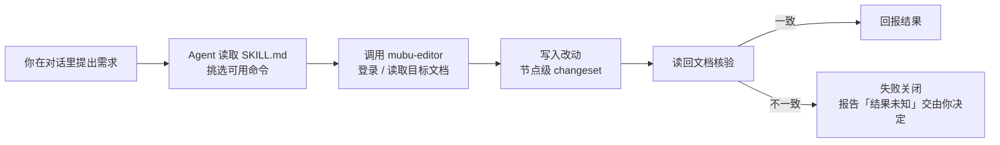

# mubu-editor
 
> 给你的 AI Agent 一双手，让它直接操作幕布 —— 读、写、编辑你账号里的幕布文档。

[](https://www.python.org/)
[](https://github.com/Rainier-Z/mubu-editor/actions/workflows/test.yml)
[](LICENSE)


## 项目简介

**mubu-editor** 是一个**给 AI Agent 用的幕布接入层**。

它让 Agent 直接读、写、编辑你账号里的幕布文档：节点文本、标题层级、原生样式（挖空 / 高亮 / 公式）、文档内链与节点引用、概要、待办、Emoji、原生表格、图片和连接线。

它适合**已经用 AI Agent 管理知识库**的人，解决一个具体痛点：**幕布没有开放平台**，Agent 拿不到它 —— 你的大纲因此进不了 Agent 的工作流。

## 用途

装好之后，你只要用自然语言说：

```text
你    > 把我幕布里那篇「读书笔记」的第 3 章标题都改成二级，
        给这一章加个概要，再开一个分享链接。

Agent > 改好了：3 个标题已设为二级，概要已覆盖第 3 章的全部 7 个节点，
        分享链接 https://share.mubu.com/doc/xxxxxxxx
        （每一步写入后都读回文档核验过）
```

Agent 自己挑命令、执行、**再读回核验** —— 你不需要记任何参数。

## 项目亮点和功能点

### 项目亮点

| 亮点 | 说明 |
| --- | --- |
| **编辑到节点级，不只是读写整篇** | 能改文档**里面**的东西：文本、标题层级、样式、结构、图片、表格与链接 |
| **以 Skill 形式接入 Agent** | 仓库自带技能定义 `SKILL.md`，接一次就能让 Agent 知道何时该用它 |
| **能力覆盖完整** | 42 个命令，覆盖账号、文档管理、节点编辑、样式、结构化元素、协作与导出 |

### 核心功能

| 功能 | 说明 |
| --- | --- |
| **账号与连接** | 手机号密码登录，Token 临近过期自动重登 |
| **文档与文件夹管理** | 列出 / 新建 / 读取 / 保存 / 重命名 / 移动 / 软删除，本地回收站可恢复 |
| **节点级编辑** | 追加节点、插入子节点、移动排序、删除子树、折叠展开、待办状态、Emoji、连接线 |
| **文本与样式** | 标题层级统一设置、文字挖空、高亮、幕布原生公式、加粗与颜色 |
| **结构化元素** | 原生表格（生成 / 导出）、本地图片上传、多节点概要、文档内链、节点引用、原生超链接 |
| **协作与资产** | 双向链接「谁引用了我」、官方导入通道、视图切换 |
| **导出** | OPML / FreeMind、整树导出、表格导出为 Markdown / CSV |

## 工作流程



## 入门指南

**前提**：Python 3.10+ · 你自己的幕布账号 · 一个支持 Skill 的 Agent（Codex / Claude Code）

```bash
git clone https://github.com/Rainier-Z/mubu-editor.git
cd mubu-editor
pip install -r requirements.txt
```

配置凭据（环境变量优先；也可写入 `config/.env.mubu`，文件权限自动 `0o600`）：

```bash
export MUBU_PHONE="你的手机号"
export MUBU_PASSWORD="你的密码"
```

把 Skill 安装给 Agent —— **目标目录由你决定**：

```bash
./install-skill.sh ~/.codex/skills/mubu-editor          # 链接安装（改仓库立即生效）
./install-skill.sh /path/to/skills/mubu-editor          # 放哪都行
./install-skill.sh ~/.codex/skills/mubu-editor copy     # 复制安装（自包含副本）
```

Windows 用 `./install-skill.ps1 -Destination <目标目录>`，加 `-Copy` 则复制。

之后直接用自然语言让 Agent 操作幕布，例如「列出我幕布根目录的文档」。
## 最小验证场景

需要验证工具链是否通了，可以手动跑一次登录：

```bash
python3 scripts/mubu_api.py login
```

预期结果：

```text
登录成功
```

## 免责声明

- 本项目与幕布（Mubu）官方**无隶属、无合作关系**，属非官方集成。
- 仅用于操作**使用者本人账号**下的数据；凭据由使用者自行提供、自行保管。
- 使用前请确认符合幕布用户协议及当地法律法规；因使用本工具产生的**账号与数据风险由使用者自负**。
- 本工具**不提供**绕过付费、批量抓取、多账号轮换、非授权访问等能力，也不应用于上述用途。

## 贡献

欢迎提交 Issue、改进建议和 Pull Request。

1. 分叉项目
2. 创建功能分支

   ```bash
   git checkout -b feature/AmazingFeature
   ```

3. 提交变更

   ```bash
   git commit -m "Add AmazingFeature"
   ```

4. 推送分支

   ```bash
   git push origin feature/AmazingFeature
   ```

5. 开启拉取请求

## License

[MIT](LICENSE)
