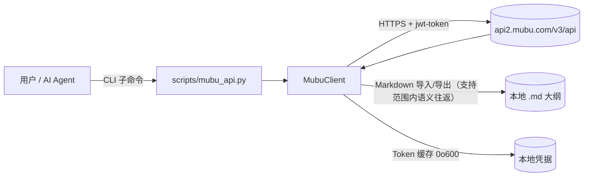
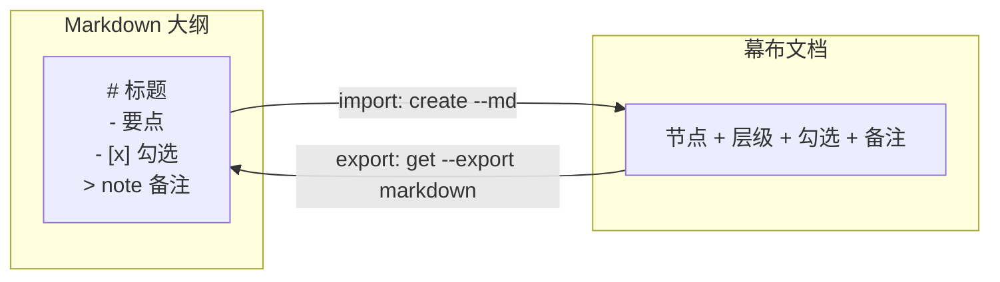

[English](README.md) | [中文](README.zh-CN.md)

<p align="center">
  
</p>

# mubu-editor

> 把幕布变成 Markdown 原生、可被 AI Agent 操控的大纲工具。

[](https://opensource.org/licenses/MIT)

通过命令行管理你的幕布（Mubu）大纲 —— **同时作为一个 AI Agent Skill** —— 对受支持的大纲结构提供 Markdown 导入/导出的语义往返。

---

## ✨ 三条命令上手（magic moment）

```bash
python3 scripts/mubu_api.py create "周会" --md weekly.md              # Markdown 大纲 → 幕布
python3 scripts/mubu_api.py get <doc-id> --export markdown > out.md  # 幕布 → Markdown
diff weekly.md out.md                                               # 此示例支持范围内可逐行相同
```

---

## 🆚 为什么选 mubu-editor？

| 能力 | 手动复制 | 现有导出插件脚本 | **mubu-editor** |
| :--- | :---: | :---: | :---: |
| 幕布 → Markdown | ✅ | ⚠️ 部分 | ✅ |
| Markdown → 幕布 | ❌ | ❌ | ✅ **（唯一）** |
| 支持的大纲语义往返 | ❌ | ❌ | ✅ **（唯一）** |
| 整树批量 / OPML / FreeMind | ❌ | ⚠️ 部分 | ✅ |
| 可被 AI Agent 调用 | ❌ | ❌ | ✅ **（唯一）** |
| 命令行可脚本化 | ❌ | ⚠️ | ✅ |

---

## 💡 使用场景

**① 让 AI Agent 直接读写你的幕布** —— 把幕布变成 Agent 的长期结构化记忆。

```bash
python3 scripts/mubu_api.py get <doc-id> --export markdown > memory.md   # Agent 拉取最新大纲
# ... Agent 编辑 memory.md ...
python3 scripts/mubu_api.py save <doc-id> --md memory.md                 # 把更新后的大纲写回幕布
```

**② Obsidian ↔ 幕布 双向大纲** —— 以纯 Markdown 让你的知识库和大纲工具保持同步。

```bash
python3 scripts/mubu_api.py get <doc-id> --export markdown > vault/notes/mubu.md   # 幕布 → Obsidian
python3 scripts/mubu_api.py create --md vault/notes/mubu.md --folder <folder-id>   # Obsidian → 幕布
```

**③ 周会纪要自动归档** —— 一步把 `examples/weekly.md` 推入幕布。

```bash
python3 scripts/mubu_api.py create "周会" --folder <folder-id> --md examples/weekly.md
```

---

## 🚀 30 秒快速体验

1. 配置幕布凭据（手机号 + 密码）。凭据**不会**作为命令行参数传递 —— 用环境变量或本地文件：

   ```bash
   export MUBU_PHONE="你的手机号"
   export MUBU_PASSWORD="你的密码"
   ```

   …或写入仓库外的 `config/.env.mubu`（环境变量优先；文件权限自动 `0o600`）：

   ```ini
   MUBU_PHONE=你的手机号
   MUBU_PASSWORD=你的密码
   ```

2. 使用自带的示例大纲（`examples/weekly.md`）：

   ```markdown
   # 产品周会
   - 上周进展
     - [x] 上线新版本
     - [ ] 修复登录 bug
   - 本周计划
     - 性能优化
   > 备注：记得同步给设计团队
   ```

3. 导入后再导出来 —— 支持的顶层标题、`[x]` / `[ ]` 勾选和归属明确的 `> note` 备注会按语义还原；Markdown 不表示图片、折叠状态等所有幕布字段：

   ```bash
   python3 scripts/mubu_api.py create "产品周会" --folder <folder_id> --md examples/weekly.md
   python3 scripts/mubu_api.py get <doc_id> --export markdown
   ```

---

## 📦 安装

本项目按本地工作区使用。安装运行时依赖后，直接调用内置入口：

```bash
python -m pip install -r requirements.txt
```

这会为你的 Agent 安装该 Skill。它是一个 Python 包 —— 你还需要 **Python 3.10+** 及运行时依赖：

```bash
pip install -r requirements.txt
```

开发与测试依赖在 Linux/macOS 使用 `requirements-dev.txt`，在 Windows 使用
`requirements-dev-windows.txt`。

---

## 🛡️ 可靠性

mubu-editor 调用的是**与幕布 Web 端相同的 HTTPS 接口** —— 不爬取、不操控浏览器。

- ℹ️ **真机结果有明确范围** —— 文档内节点重排与跨父级移动已真机验证；离线测试覆盖本地路径重算和失败关闭逻辑。其它写操作仍按下方真机发布门槛核验。
- ✅ **自动测试由 CI 运行** —— GitHub Actions 配置 Python 3.10 / 3.11 / 3.12 / 3.13 矩阵；自动测试通过不等同于真机 E2E。
- ✅ **自动刷新鉴权** —— Token 过期后用缓存凭据（环境变量 / `config/.env.mubu`）自动重新登录，初始配置后无需再次手动输入。
- ✅ **依赖全量锁定** —— `requirements*.txt` 锁定精确版本且带哈希（pip 自动校验）；锁文件由人工有意更新，不使用自动依赖 PR。
- ✅ **数据边界清晰** —— 工具仅以你的凭据访问你自己账号下的数据。凭据仅本地存储于 `config/.mubu_token`，权限 `0o600`（仅本人可读写）。

<details>
<summary>技术细节</summary>

mubu-editor 是一个**非官方**集成，使用的接口与幕布 Web 端一致。核心请求使用幕布 v3 API，部分功能还使用 v4 端点和火山引擎 TOS 签名上传；鉴权 JWT 通过请求头 `jwt-token` 传递。`access_token` 约 2 小时过期并自动刷新（仅重试 1 次，避免锁定死循环）；`403` 及其它错误不触发重新登录。

**已知限制：** 大纲折叠状态 `expand`、有序列表 `1.`、图片 / 附件节点不在当前 Markdown 往返范围。Markdown 表达受支持的大纲语义，不是所有幕布元数据的字节级备份；它也不是实时双向同步（无 diff/merge），重复导入会生成新副本。

</details>

---

## 工作区结构

仓库包含代码与文档；`config/` 是本机运行配置，可能含凭据和 Token，封装、分享或备份时必须排除该目录：

```
mubu-editor/
├── scripts/
│   ├── mubu/              核心库：client / commands / cli / config / convert / methods
│   └── mubu_api.py        CLI 入口（42 个命令）
├── config/                本机运行配置（凭据 / Token），已在 .gitignore，不入库
├── docs/                  changeset 协议速查
├── tests/                 测试
├── SKILL.md               通用技能说明
└── README.md / README.zh-CN.md
```

配置来源按组选择，避免从不同安装位置拼接出一套配置：`MUBU_CONFIG_DIR` 与各 `MUBU_TOKEN_FILE` / `MUBU_TRASH_FILE` / `MUBU_ENV_FILE` 显式路径优先；没有显式路径时，若项目 `config/` 已有任一已知配置文件，则所有默认路径均取自项目 `config/`；否则若发现旧配置，则整体沿用旧布局（Token 在 `~/.mubu_token`，环境与回收站文件在 `~/.workbuddy/`）。凭据值仍按环境变量优先于 `.env.mubu` 文件加载。`MUBU_BASE_URL` 仅接受 HTTPS、无凭据/查询/片段、默认端口且主机名为 `api2.mubu.com`、`api.mubu.com` 或 `mubu.com` 的地址；不合规时忽略并使用默认地址。

`export-tree` 不覆盖已存在文件；清理后的同名文件和文件夹共享大小写不敏感的路径命名空间，冲突会追加序号生成唯一文件名。

## 写入、同步与真机发布门槛

- `save` 使用带 `path` 的节点级 `create` / `update` / `delete` changeset 同步文档，不回写整棵树；嵌套节点的路径包含 `children` 段，例如 `["nodes", 0, "children", 1]`。每次写后重新读取并核验语义结果。底层 `save_doc(events=...)` 拒绝空列表、缺失或无效事件；空定义 `{}` 是合法的空文档定义，而 `nodes` 为非数组等结构错误会失败。
- `update.updated` 是部分字段补丁而不是完整节点：已提供的真机观察中，`collapsed` 更新载荷为 `{id, collapsed}`，`text` 更新载荷为 `{id, text, modified, highlight, color}`。保持 `original` 的现有构造形状；其他字段组合尚需隔离文档真机验证。
- 同步优先按节点 ID 对齐；重复节点 ID 或无法唯一消解的身份匹配会中止，不猜测节点。保留目标内容未声明的现有字段，包括 `highlight`、`color` 和未知/未来字段；显式传入的字段仍会按目标值更新。
- 真机观察表明读回可省略默认 `children=[]`、`priority=0`、`highlight=""`、`taskStatus=0`、`note=""`、`collapsed=false`、`finish=false`、`color=""`、`deadline=0`、`remindAt=0`；核验会将这些缺失视为默认值。非默认值仍须匹配，节点 `id` 与 `text` 也须匹配。
- Markdown checkbox 由 `taskStatus` 决定：`0` 为普通节点，`1` 为未完成待办，`2` 为已完成待办；`finish` 单独存在时不显示 checkbox。
- 同父重排和跨父级移动已通过 `structureChanged` 实现并真机验证；每一步写入后重新读回并按最新树重算路径。身份存在歧义、目标父节点位于待移动节点自身子树、或目标父节点是在同一同步中新建时会失败关闭。CLI `move` 指移动文档/文件夹，仍须满足其自身真机发布门槛。
- `create` 会在发起远端创建前校验输入。远端先建空文档，再逐个写入顶层节点；若部分写入失败，错误会报告 `doc_id`、已完成/总数及已确认的节点 ID。先查询该 `doc_id` 的当前状态，再决定如何续作，避免盲目创建副本。
- 写请求发生超时、连接中断或服务端 5xx 时不会自动重放；服务端可能已完成操作，工具可能报告“结果未知”。先用 `get` 或列表查询核实服务端状态，确认后再决定是否重试。
- Markdown 语义往返：每个一级标题独立成为顶层节点，其后的列表归属到该标题；标题和列表项支持 `[x]` / `[ ]`。根 note 使用不缩进的 `> `，列表节点 note 比列表项多缩进两个空格，多行引用行组成同一个 note。节点文本若字面上以 checkbox 样式开头，导出会转义前缀，重新导入时还原；不支持或跳级的结构报错而不会静默压平。
- **真机发布门槛：** 新增或修改的写操作须在隔离文档完成“新建空文档 → 写入 → 读回语义核验”真机 E2E 后才能宣称真机可用。永久验收脚本为 `python scripts/validation/live_write_e2e.py --yes [--folder <folder-id>]`；它会创建唯一临时文档并最终 purge 该文档。运行前须取得用户明确授权；`--yes` 只是脚本参数，不能替代用户授权。

## ⚙️ 工作原理



Markdown 大纲 ⇄ 幕布文档（支持范围内语义往返）示意：



**项目结构**（模块化 Python 包；`scripts/mubu_api.py` 为向后兼容 shim）：

```
scripts/
├── mubu_api.py        # 向后兼容 shim（重新导出 mubu 包）
    └── mubu/              # 模块化 Python 包
    ├── __init__.py    # 包标识（__version__）
    ├── config.py      # 常量 / 配置 / 日志 / MubuError / 路径安全 / Token 锁
    ├── convert.py     # 文档 ↔ Markdown / OPML / FreeMind 转换 + 展示格式化
    ├── client.py      # MubuClient（鉴权 / 请求 / 文档·文件夹·搜索·整树导出）
    ├── cli.py         # 命令参数解析、日志配置和统一分发入口
    ├── commands.py    # 登录、读写、搜索、导出、整理、回收站等系统命令
    └── methods/       # 带用户规则、可复用的业务方法
        ├── __init__.py  # 方法注册表
        ├── colors.py    # 通用颜色注册表与颜色 class 解析
        └── headings.py  # 语义标题级别与标题写入方法
```

`methods/` 是用户规则层，放可复用的格式约定；系统级登录、搜索、导出和回收站命令仍归 `commands.py`。基础颜色集中登记在 `colors.py`，由通用样式方法组合加粗、斜体、下划线和颜色。当前模板验证了红、黄、绿、蓝、紫五种颜色；黑色是默认文本色，不添加颜色 class。

标题规则集中在 `headings.py`：语义级别 1 对应 `heading=1`、红色加粗；级别 2 和 3 分别对应 `heading=2/3`、加粗；模板级别 4 在幕布中是 `heading=0` 的普通节点加粗，因为幕布没有 `heading=4`。这里的语义级别与节点在树中的深度是两回事。

`append_headings()` 每次都会新建节点，重复调用会产生重复标题；`set_headings()` 才用于把现有顶层节点设为目标样式，合规节点不会写入，不足的节点会补齐。目标数量少于现有节点时会报错；如需删除多余顶层节点，使用 `del-node`（真实 `delete` changeset，级联删除子树）。

Python API 和 CLI 默认都使用级别 1；选择其他语义级别时传 `level=2` 等参数，或在 `append` / `set-headings` 命令中使用 `--level 2`。例如：

```python
c.append_headings(doc_id, ["二级标题"], level=2)
c.set_headings(doc_id, ["三级标题"], level=3)
```

```bash
python3 scripts/mubu_api.py append <doc_id> "二级标题" --level 2
python3 scripts/mubu_api.py set-headings <doc_id> "三级标题" --level 3
```

---

### 分层判定：什么进 methods，什么算系统命令

判定只用一句话：

> **只是在调用幕布能力，属于系统命令；加入了你的规则、格式或多步流程，才属于方法。**

| 归属 | 判据 | 例子 |
|---|---|---|
| **系统命令**（`client.py` / `commands.py` / `cli.py`） | 幕布本身就能做的事，代码只是把 API 包一层 | `list` / `get` / `create` / `save` / `move` / `rename` / `delete` / `purge`，以及**插入原生表格**、**删除节点** |
| **方法**（`methods/`） | 在幕布能力之上，叠加了**你自己的**规则、格式或多步流程 | `headings.py`：一级标题固定 `heading=1` + 红色 + 加粗（导出即 `#`）；四级标题模板；颜色白名单 |

反向验证同样成立：把「你的规则」抽掉之后功能依然完整，它是系统命令；抽掉之后功能就不成立，它才是方法。

## 📚 命令行参考

<details>
<summary>展开全部 42 个命令</summary>

```bash
# 登录（首次使用需先配置凭据）
python3 scripts/mubu_api.py login

# 获取根目录列表
python3 scripts/mubu_api.py list

# 获取子文件夹内容
python3 scripts/mubu_api.py list --folder <folder_id>

# 创建文件夹
python3 scripts/mubu_api.py mkdir "新文件夹"

# 创建文档
python3 scripts/mubu_api.py create "新文档" --folder <folder_id>

# 从 Markdown 文件导入创建文档
python3 scripts/mubu_api.py create "新文档" --folder <folder_id> --md examples/weekly.md

# 获取文档内容（JSON）
python3 scripts/mubu_api.py get <doc_id>

# 导出为 Markdown（输出实际大纲，不是占位内容）
python3 scripts/mubu_api.py get <doc_id> --export markdown

# 保存文档
python3 scripts/mubu_api.py save <doc_id> --content "内容"
python3 scripts/mubu_api.py save <doc_id> --file content.md

# 从 Markdown 文件导入更新文档
python3 scripts/mubu_api.py save <doc_id> --md outline.md

# 按标题样式追加 / 设置已有顶层节点
python3 scripts/mubu_api.py append <doc_id> "一级标题"
python3 scripts/mubu_api.py set-headings <doc_id> "一级标题"

# 移动文档到其他文件夹
python3 scripts/mubu_api.py move <doc_id> --target <folder_id>

# 软删除：移入本地回收站，云端仍在；可用 restore 恢复（必须显式 --yes；--type 默认 folder）
python3 scripts/mubu_api.py delete <id> --type folder --yes
python3 scripts/mubu_api.py delete <doc_id> --type doc --yes

# 查看本地回收站 / 恢复 / 彻底删除（purge 不可恢复）
python3 scripts/mubu_api.py trash
python3 scripts/mubu_api.py restore <id>
python3 scripts/mubu_api.py purge <id> --type doc --yes

# 按名称本地搜索文档/文件夹（递归遍历所有子文件夹，大小写不敏感）
python3 scripts/mubu_api.py search "项目"
python3 scripts/mubu_api.py search "项目" --json

# 递归导出整个文件夹树为嵌套 Markdown 文件（默认当前目录，--output 指定输出根）
python3 scripts/mubu_api.py export-tree --folder <root_folder_id> --output ./backup

# 重命名文档（走 save_doc 的 name 参数，保留正文内容）
python3 scripts/mubu_api.py rename <doc_id> --name "新标题" --type doc

# 重命名文件夹（端点 /list/rename_folder，folderId 填自身 id）
python3 scripts/mubu_api.py rename <folder_id> --name "新文件夹名" --type folder

# 导出为 OPML 2.0 / FreeMind（兼容 XMind 等其它大纲工具）
python3 scripts/mubu_api.py opml <doc_id> --format opml
python3 scripts/mubu_api.py opml <doc_id> --format freeplane

# 在已有节点下插入子节点（系统命令：幕布原生 create changeset；--parent 支持顶层序号或完整路径）
python3 scripts/mubu_api.py insert-child <doc_id> --parent 5 "子节点A" "子节点B"
python3 scripts/mubu_api.py insert-child <doc_id> --parent nodes,0,children,0 "更深一层"

# 超链接：把文字变成幕布原生链接（--path 改写已有节点；--parent 挂到父节点下；缺省新建顶层节点）
python3 scripts/mubu_api.py link <doc_id> --path 0 --url https://example.com --text 点我
python3 scripts/mubu_api.py link <doc_id> --url https://example.com --text 点我
# 切换文档视图：大纲 / 思维导图 / 演示（真实 settingChanged changeset）
python3 scripts/mubu_api.py view <doc_id> mindmap
# 开启 / 刷新 / 关闭分享链接（真实端点，返回 https://share.mubu.com/doc/<shareId>）
python3 scripts/mubu_api.py share <doc_id>
python3 scripts/mubu_api.py share <doc_id> --refresh   # 旧链接失效
python3 scripts/mubu_api.py share <doc_id> --close
# 查看「谁引用了我」（双向链接反向查询）
python3 scripts/mubu_api.py refs <doc_id>
# 模板：列出 / 用模板创建文档
python3 scripts/mubu_api.py templates
python3 scripts/mubu_api.py template-use <uuid> --name "新文档"
# 官方导入通道：一次请求建出带内容的文档
python3 scripts/mubu_api.py import-doc "标题" --md file.md
# 标签：列出全部 / 搜索建议（注意是 GET，v4 端点）
python3 scripts/mubu_api.py tags
python3 scripts/mubu_api.py tags --search 关键词
python3 scripts/mubu_api.py import-doc "标题" --json definition.json --new-tab

# 原生文本格式：挖空 / 高亮（写入节点 text 中的原生 HTML；各命令须通过真机 E2E 门槛）
python3 scripts/mubu_api.py mask <doc_id> --path <node-path> --text <text>
python3 scripts/mubu_api.py highlight <doc_id> --path <node-path> --text <text> [--color yellow]

# 原生公式 / 文档内链 / 节点引用
python3 scripts/mubu_api.py formula <doc_id> --path <node-path> --latex <latex> [--block]
python3 scripts/mubu_api.py mention <doc_id> --path <node-path> --target-doc <target-doc-id> --name <name>
python3 scripts/mubu_api.py node-mention <doc_id> --path <node-path> --target-doc <target-doc-id> --target-node <target-node-id> --text <text>

# 概要：成员节点参数可重复传入
python3 scripts/mubu_api.py summary-create <doc_id> --member <node-path> [--member <node-path> ...] [--text <text>]
python3 scripts/mubu_api.py summary-delete <doc_id> <summary-id> --member <node-path> [--member <node-path> ...]

# 节点字段 / 移动排序
python3 scripts/mubu_api.py emoji <doc_id> --path <node-path> --value <emoji>
python3 scripts/mubu_api.py task <doc_id> --path <node-path> --status <0|1|2>
python3 scripts/mubu_api.py collapse <doc_id> --path <node-path> [--expand]
python3 scripts/mubu_api.py move-node <doc_id> --path <source-path> <index> [--parent <parent-path>]

# 图片 / 节点连接线
python3 scripts/mubu_api.py image <doc_id> --path <node-path> --file <png-or-jpeg> [--width <pixels>]
python3 scripts/mubu_api.py link-nodes <doc_id> --from-path <from-path> --to-path <to-path> [--side left|right|top|bottom]

# 删除文档内的顶层节点（级联删除整棵子树，不可逆，必须显式 --yes）
python3 scripts/mubu_api.py del-node <doc_id> --index 5 --yes

# 原生表格：缺省追加到顶层，也可追加到父节点路径；--replace 与 --parent-path 互斥
python3 scripts/mubu_api.py table <doc_id> --md table.md
python3 scripts/mubu_api.py table <doc_id> --json rows.json
python3 scripts/mubu_api.py table <doc_id> --parent-path 0.1 --md table.md
python3 scripts/mubu_api.py table <doc_id> --md table.md --replace 3

# 原生表格反向导出为 Markdown / CSV：必须二选一指定顶层 --index 或节点 --path
python3 scripts/mubu_api.py export-table <doc_id> --index 3 --format md
python3 scripts/mubu_api.py export-table <doc_id> --path 0.1 --format md
python3 scripts/mubu_api.py export-table <doc_id> --index 3 --format csv
```

`task` 接受 `0`、`1`、`2` 三种状态，但必须遵循幕布已确认的状态流转；直接从 `0` 改为 `2` 会被拒绝，需要先经过未完成状态。

</details>

### 原生文本格式（第一批）

`mask` 和 `highlight` 改写指定节点的 `text`，分别写入幕布原生 HTML：
`<span class="mask">文字</span>` 与 `<span class="highlight-yellow">文字</span>`。
Python 转换器为 `mask_html(text)` 和 `highlight_html(text, color="yellow")`。
高亮目前只接受 `yellow`（`--color yellow`，默认值也是 `yellow`）。

公式、内链、节点引用、概要、Emoji、待办、折叠、移动排序、图片和节点连接线也属于原生写能力；对应命令均须通过同一轮隔离真机 E2E（新建空文档 → 写入 → 读回核验）后，才可宣称可用。当前说明只记录接口约定，不代表已经完成真机验证。

---

## 🤖 Agent 触发词

> 幕布、mubu、幕布大纲导入导出

当对话中出现以上关键词时，Skill 可被自动触发。

---

## 🧪 测试与 CI

本地运行全部测试：

```bash
PYTHONPATH=scripts python -m pytest -v
```

持续集成会在配置的 Python 版本矩阵中运行测试。自动化测试不替代需要单独授权的真机 E2E 验收。

---

## ⚠️ 免责声明

- 本项目与幕布（Mubu）官方**无隶属、无合作关系**，属非官方集成。
- 仅用于操作**使用者本人账号**下的数据；凭据由使用者自行提供、自行保管。
- 使用前请确认符合幕布用户协议及当地法律法规；因使用本工具产生的**账号与数据风险由使用者自负**。
- 本工具**不提供**绕过付费、批量抓取、多账号轮换、非授权访问等能力，也不应用于上述用途。

---

## ❓ 常见问题 FAQ

**Q：需要有幕布账号吗？**
A：需要。使用你的手机号 + 密码登录（`MUBU_PHONE` / `MUBU_PASSWORD`）。这是幕布官方账号，本 Skill 不提供账号。

**Q：这是非官方集成，我的凭据安全吗？**
A：凭据仅本地存储——登录 Token 写入本地文件且权限为 `0o600`（仅本人可读写），不依赖任何第三方服务。环境变量优先于 `.env.mubu` 文件加载。详见[可靠性](#-可靠性)。

**Q：支持图片 / 附件节点吗？**
A：当前不支持。大纲折叠状态 `expand`、有序列表 `1.`、图片 / 附件节点不在当前 Markdown 语义往返范围。完整已知限制见[技术细节](#-可靠性)。

---

## 📄 License

[MIT](https://opensource.org/licenses/MIT)
